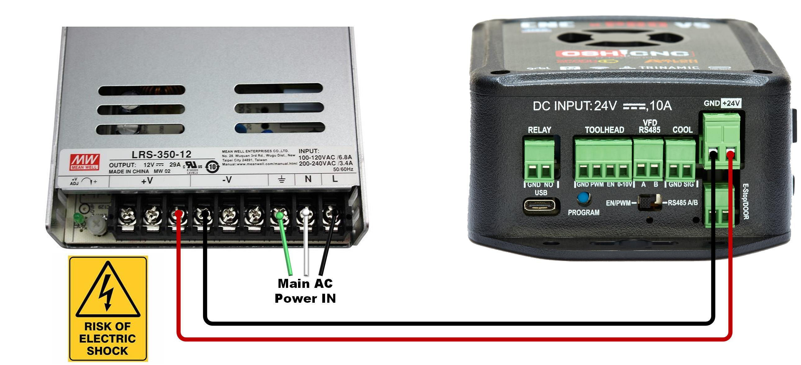
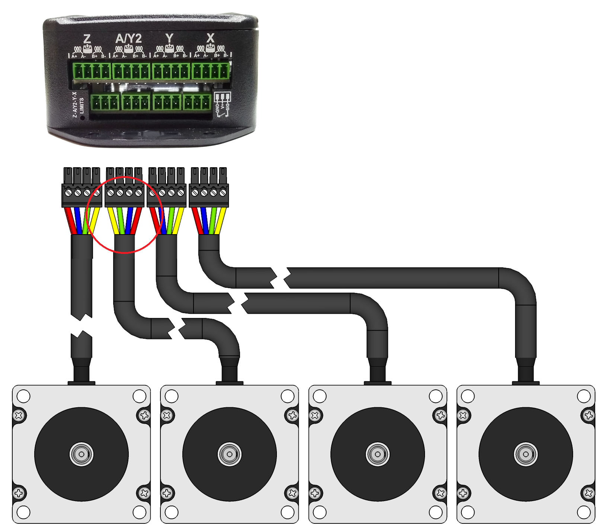
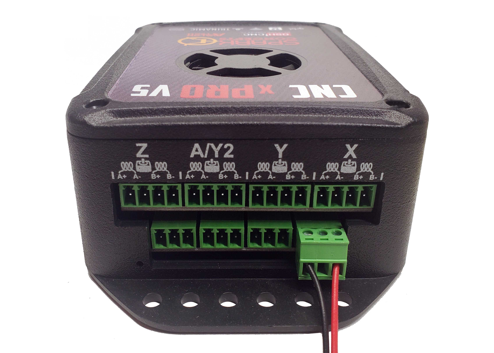
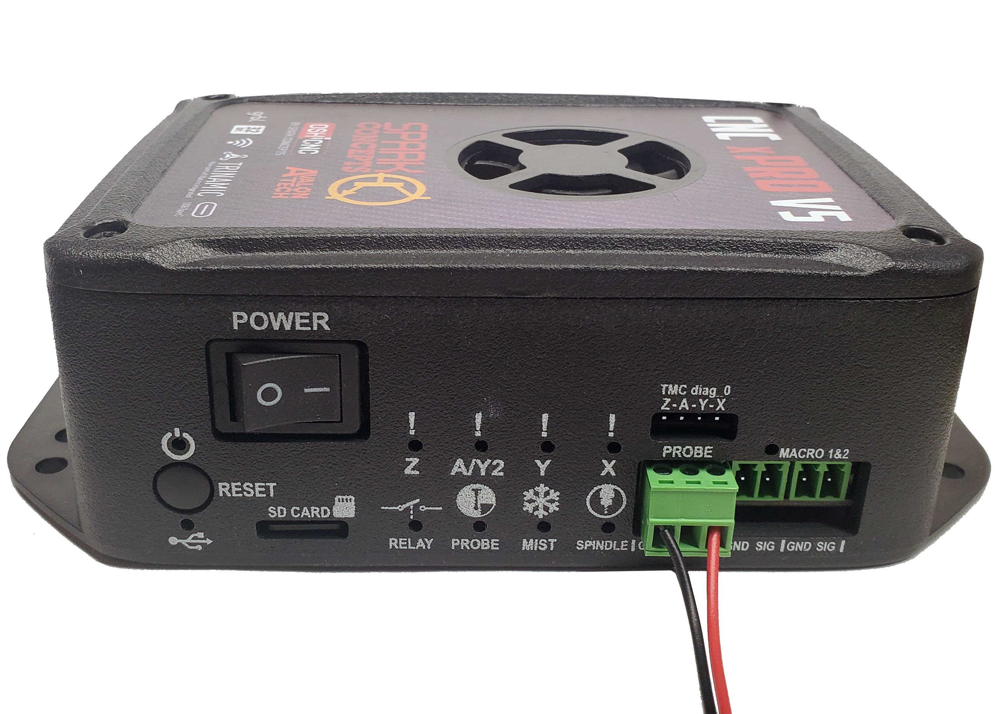
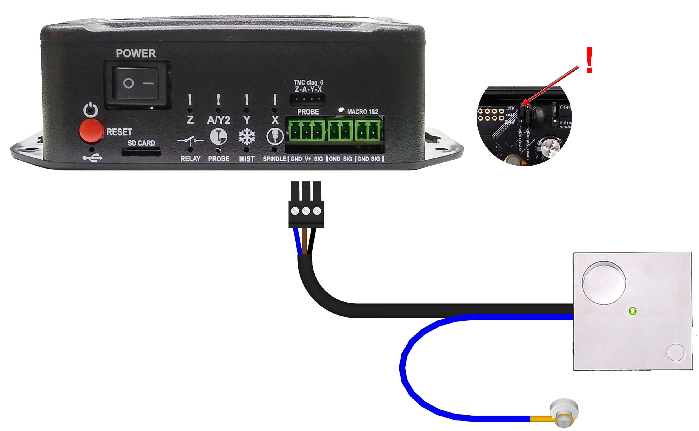
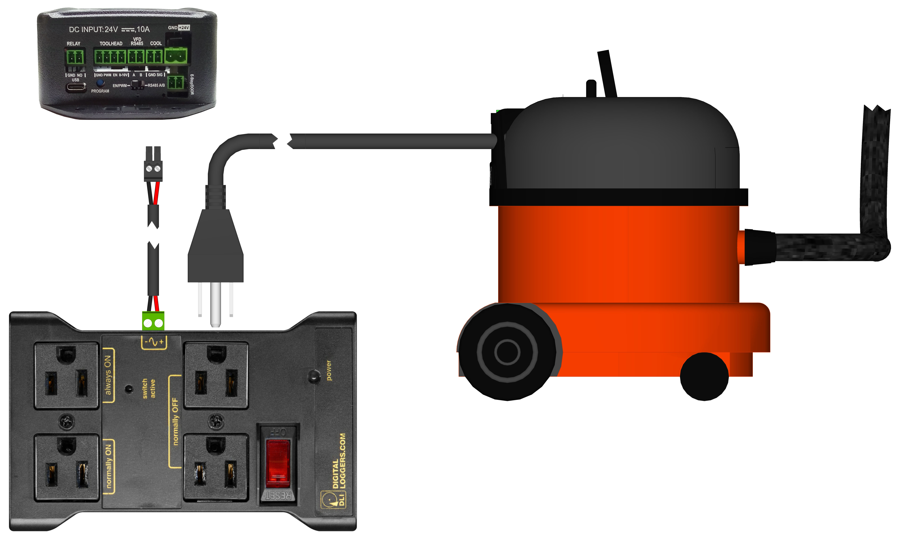

# Quick Start

## Safety Statement

---

The author of this document is not liable or responsible for any accidents, injuries, equipment damage, property damage, loss of money or loss of time resulting from improper use of electrical or mechanical or software products.

Assembling electrical and mechanical CNC machine components like power supplies, motors, drivers or other electrical and mechanical components involves dealing with high voltage AC (alternating current) or DC (direct current) and other hazardous items which can be extremely dangerous and needs high attention to detail, experience, knowledge of software, electricity, electro-mechanics and mechanics.

**BEFORE MAKING ANY CONNECTIONS OR DISCONNECTIONS POWER MUST BE REMOVED FROM THE DEVICE AND THE CONTROLLER. FAILURE TO DO SO WILL VOID ANY AND ALL WARRANTIES.**

Before starting please read through all the instructions.

## Pre-Install Notes

---

- Wire color codes or cable color code charts for both AC and DC are classified based on national standards for each region. You may find different colors in different countries. However, we like to use as much as we can specify colors for specific purposes, such as Red for 24V DC and Black for GND. Having this good practice will help you to troubleshoot possible issues that might occur in the future.
- Always use shielded cable for motors and drivers, this will minimize significantly electromagnetic interference, in consequence, this will permit you to run a job without any problem.
- **NEVER** connect or disconnect any wire while power is applied. Failure to do the above will result in damage to the stepper drivers. **ALWAYS** disconnect power before making any connections or disconnections.

## 24V DC Input Wiring

---

If you received the xPro V5 Controller bundle with a Meanwell 24V power supply, wire your system as shown below: Connect V- from the power supply to GND on the xPro and V+ from the power supply to +24V on the xPro. The mains voltage must be wired by a licensed electrician or similarly qualified individual.



Before connecting your power supply to mains power, it is critical that you check and set the [115v/230v Switch](https://i.stack.imgur.com/zWdO5.jpg) on your Power Supply.

## Stepper Motor Wiring

---

**By default the motor current is set for Nema23, 2.8A motors - verify your motor max current and adjust the (ADD LINK current settings) if needed. Your motors should run warm to the touch.**

Warning: Never connect/disconnect motors to a powered-up controller. Always turn off power before connecting/disconnecting accessories to/from your xPro

* How to: [verify coil wires](https://www.youtube.com/watch?v=S0pGKgos498)
* Simple verification of 4 wire stepper motors:
    * Using a multi-meter, resistance Set the Ohmmeter to the lowest resistance scale.
    * Attach one of the wires to the meter and, in turn, check each of the remaining three
    * Mark the wire that gave a reading and mark the first wire you started with (coil A)
    * The remaining two wires will be coil B

Connect stepper motor wires to the supplied [3.81mm connectors](https://media.digikey.com/photos/FCI%20Photos/20020004-D031B01LF.jpg) and plug in to the corresponding receptacles on the xPro-V5. Wire the above identified coil A across the A+ and A- terminal, wire coil B across the B+ and B- terminals.



NOTE: switching the polarity of either (one) coil will reverse the stepper's direction - also the color codes shown below may not apply to your particular Motors. *This is used for machines with ganged axis' where the motors face opposite directions.*

## Connecting Standard Limit Switches

---

The xPRO-V5 limit switch input uses a 3 pin connector which is provided with the controller. Connect the probe to the probe port as shown below: (connect one lead into GND and the other to SIG. Leave the middle pin unconnected)



***Warning: Incorrect wiring can short V+ to GND causing damage to your controller: Double check wiring before powering on***


Note: The use of a 3-wire inductive proximity switch SN-04-N(NO) or SN-04-N2(NC) may also be used. Standard inductive proximity switch wiring is brown = V+, blue = gnd, and black = signal (verify using the manufacturer's data sheet). Most inductive NPN NO sensors require 10 to 30 volts to operate; though most sensor's may still work using 5V, it is still recommended that you adjust the limit-switch logic voltage select jumper to 24V. Thus 24v is connected to the brown V+ and ground connected to the blue. Click HERE for more information

## Connect Probe

---

When wiring the xPRO-V5 to an unpowered touch probe, connect one wire to GND and the other to SIG; **be sure to leave the middle pin unconnected**, otherwise permanent damage may result




***Please be sure to double-check your wiring before plugging in all accessories!*** When connecting a powered probe, please refer to the diagram below:



## Connect Tools

---

### Dewalt Spindle

---

You can install an IOT Relay to control your spindle using Gcode commands


### 0-10v Analog Signal / VFD

---

Spark Concepts xPro-V5 includes a 0-10v Analog Signal Voltage output that can be used to control spindles/other toolheads that need a 0-10v signal to run.

Note: This is a low level logic Signal voltage, it should not be used to drive anything directly. This signal should be connected to an external drive system, for example a VFD or a DC Spindle Controller.

To use the signal, connect between the GND and 0-10v pins on the toolhead plug as shown.

Calibrate output voltage TIP: You may need to fine tune the output to be exactly 10v:

Send an M3 S12000 to the controller (12000 = default Grbl configuration, or send S=what you have set for $30 - Max spindle speed, RPM) Measure the voltage between GND and the 0-10v Terminal Use a small flat head screwdriver to adjust the 0-10v Fine Tuning Adjustment until the output is exactly 10.0v This will ensure that command Spindle RPM is as close to the actual as possible - M5 command turns the spindle output off


## Connect Coolant Output

---

The Coolant output is primarily used to control chip-evacuation, dust-extraction or cutting fluid systems, but can also be creatively repurposed for other switching requirements.

It can be controlled with M-Codes:

```
M8  # Turns On
```

```
M9  # Turns Off
```

Electrical Specifications:

* Voltage: jumper select - 24v(default) or 5v
* Max Current: 3A (24v only)
* Suitable for inductive loads (24v only)

### Connect LED Ring

---

You can use the Coolant output to switch any other 24v device as well, as an example, you can connect a Spindle LED Ring as shown to put it under M-Code control (for example if you want a Job to turn the LED ring on at the start and off at the end, you can add an M8 to the header and an M9 to the footer of your g-code)


### Connect Dust Extraction via IoT Relay

---

You can use our IoT Relay Power Strip to control a Vacuum for dust extraction



### Connect 24vDC Air Solonoid

---

You can switch 24v Solenoids using the Coolant output. Typically you'd use this configuration in-line between an Air-compressor and a Nozzle pointed at the endmill. Compressed air blowing on the endmill will help evacuate chips from the cut, and keep the endmill cool


## Micro Limit Switch Wiring

---

Connect the Blue lead into GND and the white lead to SIG. Leave the middle pin blank.

## Z/XYZ Touch Probe Wiring

---

The xPRO-V5 uses a 3 pin connector which is provided with the controller.

To connect the xPRO-V5 to the touch probe, connect the red wire to GND and the black wire to SIG using the provided green EDG connector. Leave the middle pin unconnected.

Connect the probe to the probe port as shown below:

To configure the XYZ probe in CNCjs [click here](https://makerhardware.net/wiki/doku.php?id=add_on_packs:xyz_touch_probe)

## Emergency Stop / Door Sensor

---

Your emergency stop switch can be wired in 2 ways. The first way is to be wired by an electrician in line with your mains lead to the 24V power supply or as a pause button for the xPRO.

The guide below shows the pause/hold method with our Normally Closed Emergency stop switches (NC).

Ensure that the jumper in the xPRO-V5 is in the disabled (default) position. Wiring it this way will pause the program when activated. To use our NC switches with the xPRO-V5, flash your xPRO with the `CNC_xPRO_V5_XYYZ_PWM_NC.bin` located in the main [firmware repository](https://github.com/Spark-Concepts/xPro-V5/tree/main/Firmware). To flash this firmware, refer to the [guide](../firmware.md).

## Machine configuration settings

---

Setting up your machine is quite straightforward. Courtesy of [makerstore.au](https://www.makerstore.com.au/) Below is a set of configuration files for each of their machine kits. These files contain their recommended settings for each machine from the working area to the motor current.

The quickest and easiest method to flash your controller with the recommended settings is by using a macro. The example below will use a WorkBee 1000 x 1000mm with High Torque motors. For now, minimize CNCjs.

1. download the master configuration [here add link](). Follow the guide below:
    * Unzip the Master Config file. In this config file is a number of folders corresponding to various machines. If you have a custom machine or a different brand of machine, contact us and our technicians will be able to assist you with your machine.
    * Navigate to the folder containing the brand of the machine series you own. For example, if you own a WorkBee 1000 x 1000mm kit, navigate to the WorkBee folder.
    * Locate the configuration file of the machine that you have. Take note of the motors attached to your machines (High Torque or Standard Torque).

    

    * Open the file and select all of its contents and COPY them.

    

    * Open CNCjs and navigate to the right-hand side of the program. Locate the macro widget. Select the + icon highlighted in green to add a macro.
    * PASTE the contents of the configuration file into the Macro Commands field and click OK.

    

    * The macro will now look like this:

    

2. To flash your controller with these new settings, make sure that the xPRO-v5 is still connected via USB and click the play button on the macro widget. The following window will show.

    

3. Clicking Run will flash the controller with the machine settings. You will only need to do this once. You may edit the macro if there are certain changes you wish to implement.

    A successful flash as shown below will show:

    

## Fine-tunin, motor direction and homing

---

### Inverting Motor direction

---

### Inverting the homing direction

---

### Jogging

---

### Probing with the XYZ probe

---

## xPRO V5 Laser Control

---

***Laser safety goggles MUST be worn whenever the laser unit’s power supply is turned on.***

CNCjs is recommended for controlling the laser. You may generate the gcode from GRBL laser and then open the gcode in CNCjs It is recommended to wear your safety glasses whenever your laser module has its power supply turned on.

The 2.5W and 15W diode lasers are built for a variety of custom laser applications so custom wiring will be required. These laser kits can be adapted for use in CNC applications with longer cables and custom mounting hardware.

To connect the laser to the Maker Shield, you will only need to connect the signal wires from the laser control board to the Maker Shield controller. All other connections are already pre-done. Locate the TTL signal port circled in orange as shown below:

TTL+ connects to the PWM connector and TTL- connects to GND on the TOOLHEAD connector port as illustrated below. The lime green wire corresponds to TTL- (Black wire) and the red wire corresponds to TTL+.

Flash the xPRO with the appropriate firmware.

* [Normally Closed Emergency Stop Switch](https://www.makerstore.com.au/download/software/CNCxPROv5_XYYZ_NC_Laser_2.bin)
* [Normally Open Emergency Stop Switch](https://www.makerstore.com.au/download/software/CNCxPROv5_XYYZ_NO_Laser.bin) In the CNCjs software, you can enable the laser mode by typing the following commands in the console:

        $Spindle/Type=Laser
        $Gcode/LaserMode=ON
        $31=1
